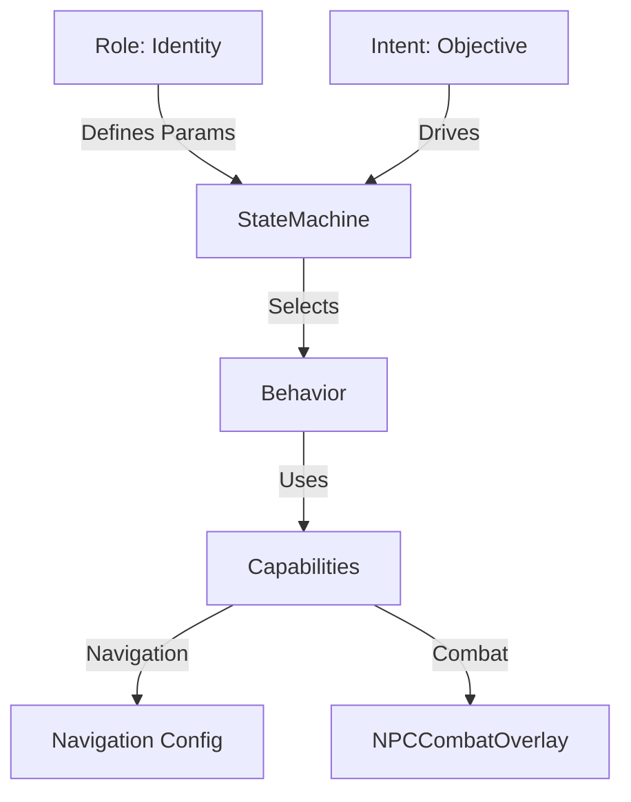

# NPC System Documentation

## 1. Overview

The NPC (Non-Player Character) system provides autonomous vessel behavior, serving as the foundation for the game's AI, economy, and combat dynamics. 

### Key Design Principles
*   **Shared Simulation**: NPCs run on the exact same physics/combat engine as players.
*   **Server Authority**: All logic is server-side; clients just render the results.
*   **Performance First**: Optimized for handling 50+ autonomous units with <1ms overhead.

## 2. Architecture

The system uses a layered architecture to separate **Identity** (Role), **Objective** (Intent), and **Action** (Capability).



### 2.1 File Structure
*   `NPCShip.js`: The main entity class extending `Ship.js`.
*   `NPCManager.js`: Handles spawning, pooling, and lifecycle.
*   `NPCRole.js`: Definitions for behaviors/stats (Trader/Pirate).
*   `NPCIntent.js`: High-level state machine constants.
*   `NPCCombatOverlay.js`: Logic for combat targeting, firing, and defensive states.

## 3. Core Components

### 3.1 Roles (`NPCRole.js`)
Roles are data-driven parameter sets that define "who" an NPC is. They are not separate classes.

| Role | Description | Flee Threshold | Aggression |
|:---|:---|:---|:---|
| **TRADER** | Mercantile ships that follow trade routes. Defensive combat only. | 50% HP | Passive |
| **PATROL** | Faction defenders. Defensive combat only. | 30% HP | Passive |
| **PIRATE** | Hostile raiders. Actively pursue and engage players. | 20% HP | Active |

### 3.2 Intents (`NPCIntent.js`)
Intents define "why" an NPC is acting at any given moment.

*   `TRAVEL`: Navigating to a destination (Harbor/Waypoint).
*   `ENGAGE`: Actively pursuing and fighting a target.
*   `EVADE`: Fleeing from a threat at full speed.
*   `WAIT`: Stationary (e.g., docked at harbor).
*   `DESPAWNING`: Cleanup phase.

**Generic State Transitions:**
*   `TRAVEL` → (Attacked & Low HP) → `EVADE`
*   `ENGAGE` → (Target Lost) → `TRAVEL`/`DESPAWN`
*   `EVADE` → (Safe Distance) → `TRAVEL`/`ENGAGE`

### 3.3 Combat Capabilities (`NPCCombatOverlay.js`)
Combat is a capability module that can be attached to any NPC.

*   **Defensive Mode**: Returns fire if fired upon, but does not pursue. (Traders)
*   **Aggressive Mode**: Actively chases and maneuvers for broadsides. (Pirates)
*   **Retaliation**: Remembers who attacked it within the last 30s.

## 4. Behaviors

### 4.1 Navigation
NPCs use a predictive "look-ahead" steering system:
1.  **Look-ahead**: Casts rays 7 tiles ahead to detect land.
2.  **Avoidance**: If blocked, searches ±15° to ±180° for a clear path.
3.  **Hysteresis**: Prevents jittering by smoothing heading changes (1.5 rad/s).

### 4.2 Combat Mechanics
*   **Broadside Positioning**: Attempts to maintain parallel engagement distance (approx 80% range).
*   **Firing Arc**: Only fires when target is within ±10° of the broadside vector.
*   **Cooldowns**: Matches player reload times (4s).

### 4.3 Evasion
When HP drops below the **Flee Threshold**:
*   **Intent**: Switches to `EVADE`.
*   **Behavior**: Calculates vector *away* from attacker.
*   **Speed**: Sets sails to 100%.
*   **Duration**: Flees until 600px away or 30s elapsed.

## 5. Developer Guide

### 5.1 Spawning NPCs
**Console Commands (Browser):**
```javascript
// Spawn 5 traders
socket.emit('debug_spawn_npcs', { count: 5 });

// Spawn 3 pirates
socket.emit('debug_spawn_pirates', { count: 3 });

// Inspect specific NPC
socket.emit('debug_npc_info', { npcId: 'npc_trader_0' });
```

**Keyboard Shortcuts:**
*   `N`: Spawn Trader nearby.
*   `P`: Spawn Pirate nearby.

### 5.2 Performance monitoring
The server logs performance ticks every 10 seconds.
*   **Target**: < 1ms avg tick time.
*   Current impact per NPC: ~0.1 - 0.3ms.

## 6. Roadmap

### Phase 4: Economy & Trading 🔄
*   Cargo system (Transporting goods).
*   Trade routes affecting harbor prices.
*   Players intercepting cargo.

### Phase 5: World Events ⏳
*   Dynamic faction wars.
*   Harbor raids.
*   Convoys.

### Phase 6: Persistence ⏳
*   Database storage for NPC states.
*   Long-term fleet tracking.

## 7. Version History
*   **v3.5 (2026-01-16)**: System Consolidation (Roles/Intents/Overlay).
*   **v3.0 (2026-01-15)**: Combat AI (Pirates).
*   **v2.0 (2026-01-15)**: Intelligent Navigation.
*   **v1.0 (2026-01-14)**: Basic Implementation.
