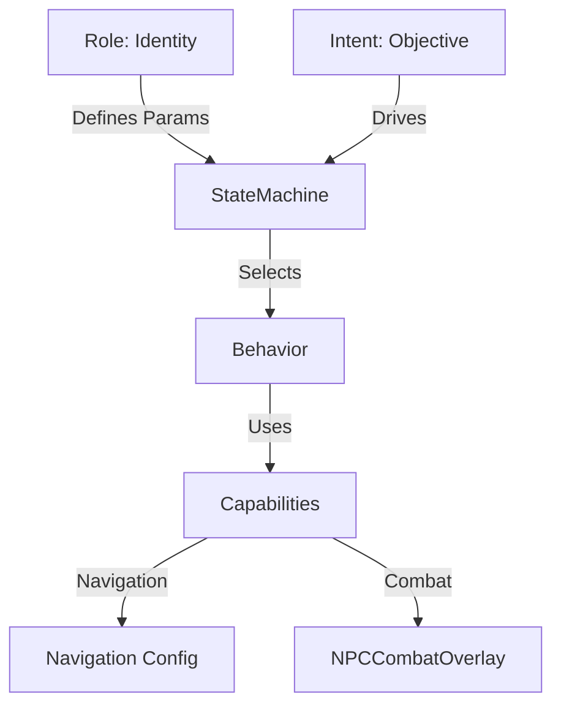

# NPC System Documentation

## 1. Overview

The NPC (Non-Player Character) system provides autonomous vessel behavior, serving as the foundation for the game's AI, economy, and combat dynamics. 

### Key Design Principles
*   **Shared Simulation**: NPCs run on the exact same physics/combat engine as players.
*   **Server Authority**: All logic is server-side; clients just render the results.
*   **Performance First**: Optimized for handling 50+ autonomous units with <1ms overhead.

## 2. Architecture

The system uses a layered architecture to separate **Identity** (Role), **Objective** (Intent), and **Action** (Capability).


```mermaid
graph TD
    Role[Role: Identity] -->|Defines Params| StateMachine
    Intent[Intent: Objective] -->|Drives| StateMachine
    StateMachine -->|Selects| Behavior
    Behavior -->|Uses| Capability[Capabilities]
    Capability -->|Navigation| Nav[Navigation Config]
    Capability -->|Combat| Combat[NPCCombatOverlay]
```

### 2.2 Living World Kernel
The world traffic layer now uses a hybrid simulation model to create ambient ship activity without globally simulating every vessel.

**Strategic Layer**
*   `StrategicTrafficManager.js` keeps a small pool of abstract ships moving between harbors.
*   Ships advance using route progress only. There is no physics, collision, or steering off-screen.
*   Routes come from `RoutePlanner.js`, which reuses the `WaypointGraph` and samples progress segment-by-segment.

**Tactical Layer**
*   `NPCMaterializer.js` turns relevant strategic ships into full `NPCShip` entities near players.
*   Materialized ships spawn at interpolated positions on route edges, not directly on waypoint nodes.
*   When ships leave player relevance, they are despawned and their approximate route progress is written back to the strategic layer.

**Local Illusion Layer**
*   `NPCMaterializer.js` also maintains lightweight local traffic so quiet seas still feel active.
*   These ships are not part of the strategic simulation and are never persisted.
*   They spawn mainly ahead of players, follow simple short lanes, and despawn once they are clearly stale or out of range.

### 2.1 File Structure
*   `NPCShip.js`: The main entity class extending `Ship.js`.
*   `NPCManager.js`: Handles spawning, pooling, and lifecycle.
*   `NPCBehavior.js`: Consolidated role, intent, and combat overlay definitions.
*   `RoutePlanner.js`: Harbor-to-harbor route planning on top of `WaypointGraph.js`.
*   `StrategicTrafficManager.js`: Abstract off-screen traffic state.
*   `NPCMaterializer.js`: Near-player materialization and local filler traffic.
*   `RegionProfiles.js`: Lightweight region-based ship class, pirate ratio, and naming variation.

## 3. Core Components

### 3.1 Roles (`NPCRole.js`)
Roles are data-driven parameter sets that define "who" an NPC is. They are not separate classes.

| Role | Description | Flee Threshold | Aggression |
|:---|:---|:---|:---|
| **TRADER** | Mercantile ships that follow trade routes. Defensive combat only. | 50% HP | Passive |
| **PATROL** | Faction defenders. Defensive combat only. | 30% HP | Passive |
| **PIRATE** | Hostile raiders. Actively pursue and engage players. | 20% HP | Active |

### 3.1.1 Region Profiles
NPC presentation is now varied by lightweight region profiles.

Each region profile defines:
*   ship class pools per role
*   regional pirate/trader mix
*   regional prefix/noun ship name pools

Harbors derive their region from existing harbor metadata, and spawns can also infer a region from nearby position when no harbor is explicitly involved.

### 3.2 Intents (`NPCIntent.js`)
Intents define "why" an NPC is acting at any given moment.

*   `TRAVEL`: Navigating to a destination (Harbor/Waypoint).
*   `ENGAGE`: Actively pursuing and fighting a target.
*   `EVADE`: Fleeing from a threat at full speed.
*   `WAIT`: Stationary (e.g., docked at harbor).
*   `DESPAWNING`: Cleanup phase.

**Generic State Transitions:**
*   `TRAVEL` → (Attacked & Low HP) → `EVADE`
*   `ENGAGE` → (Target Lost) → `TRAVEL`/`DESPAWN`
*   `EVADE` → (Safe Distance) → `TRAVEL`/`ENGAGE`

### 3.3 Combat Capabilities (`NPCCombatOverlay.js`)
Combat is a capability module that can be attached to any NPC.

*   **Defensive Mode**: Returns fire if fired upon, but does not pursue. (Traders)
*   **Aggressive Mode**: Actively chases and maneuvers for broadsides. (Pirates)
*   **Retaliation**: Remembers who attacked it within the last 30s.

## 4. Behaviors

### 4.1 Navigation
NPCs use a dual-layered navigation approach:

**1. Macro-Routing (`WaypointGraph.js`)**
*   **Static Pathing**: Uses A* entirely on a fixed 28-node graph mapping primary Caribbean sea corridors, ignoring the massive tile grid.
*   **Spawn Interception (`NavigationUtils.js`)**: NPCs dynamically compute orthogonal distance from their spawn locations to the first line segment of their route. If they hit an open-sea `isLineOfSightClear()` verify, they dynamically merge onto the open lane.

**2. Micro-Avoidance (Predictive Look-Ahead)**
*   **Detection**: Casts rays 7 tiles ahead to detect land tiles or ships.
*   **Searching**: If blocked, scans ascending angles (±15°, ±30°...) for a clear substitute vector.
*   **Smoothing**: Uses angular hysteresis (1.5 rad/s) interpolating slowly back to the `desiredHeading`.

### 4.1.1 Strategic Route Progress
Strategic traffic progress is accumulated across route segments, not by interpolating directly from origin to destination.

Example:
*   For route `[A, B, C]`, progress first advances along `A -> B`, then along `B -> C`.
*   Materialized ships appear at the interpolated point on the active segment, which prevents ships from clustering at nodes.

### 4.1.2 Local Traffic
Local traffic is a player-proximate illusion layer, not a world simulation system.

*   Maintains a minimum ambient ship presence near players.
*   Spawns ahead of players rather than uniformly in all directions.
*   Prefers crossing and oncoming movement, with some same-lane traffic for variety.
*   Uses short precomputed lanes instead of full harbor pathfinding.
*   Keeps ships alive while they are near players or recently involved in combat.

### 4.2 Combat Mechanics
*   **Broadside Positioning**: Attempts to maintain parallel engagement distance (approx 80% range).
*   **Firing Arc**: Only fires when target is within ±10° of the broadside vector.
*   **Cooldowns**: Matches player reload times (4s).

### 4.3 Evasion
When HP drops below the **Flee Threshold**:
*   **Intent**: Switches to `EVADE`.
*   **Behavior**: Calculates vector *away* from attacker.
*   **Speed**: Sets sails to 100%.
*   **Duration**: Flees until 600px away or 30s elapsed.

## 5. Developer Guide

### 5.1 Spawning NPCs
**Console Commands (Browser):**
```javascript
// Spawn 5 traders
socket.emit('debug_spawn_npcs', { count: 5 });

// Spawn 3 pirates
socket.emit('debug_spawn_pirates', { count: 3 });

// Inspect specific NPC
socket.emit('debug_npc_info', { npcId: 'npc_trader_0' });
```

**Keyboard Shortcuts:**
*   `N`: Spawn Trader nearby.
*   `P`: Spawn Pirate nearby.

### 5.2 Performance monitoring
The server logs performance ticks every 10 seconds.
*   **Target**: < 1ms avg tick time.
*   Current impact per NPC: ~0.1 - 0.3ms.

## 6. Roadmap

### Phase 4: Economy & Trading 🔄
*   Cargo system (Transporting goods).
*   Trade routes affecting harbor prices.
*   Players intercepting cargo.

### Phase 5: World Events ⏳
*   Dynamic faction wars.
*   Harbor raids.
*   Convoys.

### Phase 6: Persistence ⏳
*   Database storage for NPC states.
*   Long-term fleet tracking.

## 7. Version History
*   **v4.0 (2026-04-18)**: Living World Kernel, local traffic filler, and region-based ship variation.
*   **v3.5 (2026-01-16)**: System Consolidation (Roles/Intents/Overlay).
*   **v3.0 (2026-01-15)**: Combat AI (Pirates).
*   **v2.0 (2026-01-15)**: Intelligent Navigation.
*   **v1.0 (2026-01-14)**: Basic Implementation.
